<p align="center">
  
</p>

<h1 align="center">站点监测</h1>

<p align="center">优雅的站点状态监控面板</p>

<p align="center">
  
  
  
</p>

<p align="center">
  <a href="https://console.cloud.tencent.com/edgeone/pages?action=create" title="使用腾讯云 EdgeOne Pages 部署">
    
  </a>
</p>

<p align="center">🎮 在线演示：
  <a href="https://status.tjqaq.com" target="_blank">
    https://status.tjqaq.com
  </a>
</p>

## 📖 简介

站点监测是一个基于 UptimeRobot API 开发的站点状态监控面板，支持多站点状态监控、实时通知、故障统计等功能。界面简洁美观，响应式设计，支持亮暗主题切换。

## ✨ 功能预览


## ✨ 特性

- 📊 实时监控：支持多种监控方式
- 📱 响应式设计：适配移动端和桌面端
- 🌓 主题切换：支持亮色/暗色主题
- 📈 数据统计：可视化展示可用率和响应时间
- 🔔 故障记录：详细的宕机记录和原因分析
- 🔄 自动刷新：定时自动更新监控数据
- 💫 平滑动画：流畅的用户界面交互体验

## ⚙️ 部署配置

### 环境要求

- Node.js >= 16.16.0
- NPM >= 8.15.0 或 PNPM >= 8.0.0

### 获取 UptimeRobot API Key

1. 注册/登录 [UptimeRobot](https://uptimerobot.com/)
2. 进入 [Integrations & API](https://dashboard.uptimerobot.com/integrations)
3. 下拉到最底部在 Main API keys 部分创建 **Read-Only API Key**
4. 复制生成的 API Key

### API 代理说明

本项目专为 **腾讯云 EdgeOne Pages** 部署设计，使用边缘函数自动处理跨域请求：

#### 部署步骤

1. 点击上方蓝色 "Deploy" 按钮进入腾讯云 EdgeOne Pages 控制台
2. 连接到 GitHub，选择项目
3. 构建配置：
   - 框架预设：`Vite`
   - 根目录：`/`
   - 构建命令：`npm run build`
   - 输出目录：`dist`
   - 安装命令：`npm install`
4. 边缘函数目录：`edge-functions/api/status.js` → 自动映射到 `/api/status`（平台自动识别无需额外配置）

#### 环境变量配置

在 EdgeOne Pages 控制台 → 项目 → **设置 → 环境变量** 中添加：

| 变量名                     | 作用                          |
| -------------------------- | ----------------------------- |
| `UPTIMEROBOT_API_KEY`      | **函数运行时**读取的 API Key |
| `VITE_UPTIMEROBOT_API_KEY` | **前端构建期**注入的 API Key |
| `VITE_UPTIMEROBOT_API_URL` | 前端代理地址，设为 `/api/status` |
| `VITE_APP_TITLE`           | 站点名称                      |

> 修改环境变量后需要 **重新部署** 才能生效。

### 快速开始

1. 克隆项目

```bash
git clone https://github.com/Xingstar520/uptime-status.git
cd uptime-status
```

2. 安装依赖

```bash
pnpm install
# 或
npm install
```

3. 配置环境变量

在 `.env` 文件中修改以下配置：

```bash
# UptimeRobot API Key
VITE_UPTIMEROBOT_API_KEY = "ur2290572-af4663a4e3f83be26119abbe"

# UptimeRobot API URL
# 部署到 EdgeOne Pages 使用默认值 `/api/status`，由 edge-functions/api/status.js 接管代理
VITE_UPTIMEROBOT_API_URL = "/api/status"

# 站点名称
VITE_APP_TITLE = "琦月图床"
```

4. 开发调试

```bash
pnpm dev
# 或
npm run dev

# 开发环境需要将 VITE_UPTIMEROBOT_API_URL 设置为 "https://api.uptimerobot.com/v2/getMonitors"
```

5. 构建部署

```bash
pnpm build
# 或
npm run build
```

构建的文件在 `dist` 目录下，将 `dist` 目录部署到服务器即可。

## 📝 开源协议

本项目基于 [MIT License](LICENSE) 开源，使用时请遵守开源协议。

## 🙏 致谢

- [UptimeRobot](https://uptimerobot.com/) - 提供监控 API 支持
- [Vue.js](https://vuejs.org/) - 前端框架
- [Tailwind CSS](https://tailwindcss.com/) - CSS 框架
- [Chart.js](https://www.chartjs.org/) - 图表库
